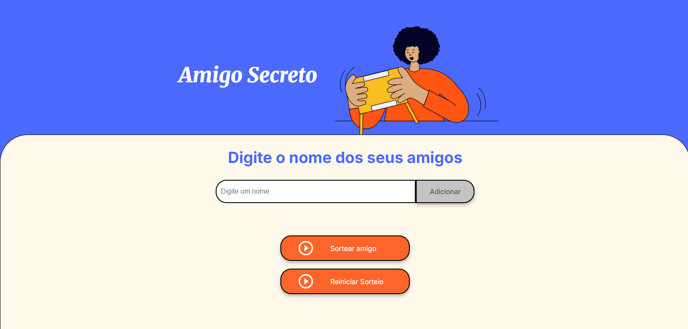
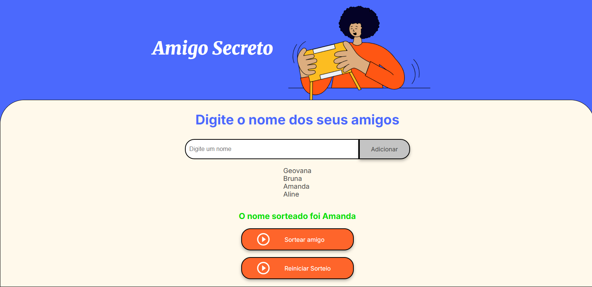

O projeto consiste em um site prático e funcional para a dinâmica de amigo secreto. Nele, o usuário deve informar no mínimo 4 nomes clicando no botão "Adicionar", que irá registrá-los e mostrá-los em formato de lista.

Ao informar os nomes desejados, o botão "Sortear Amigo" irá sortear aleatoriamente um dos participantes, assim liberando o recurso de reiniciar o sorteio, no qual os dados são limpos e pode-se iniciar a dinâmica novamente.

Linguagens Utilizadas:
- HTML;
- CSS;
- JavaScript;

Autora:
https://github.com/geovanamoreira